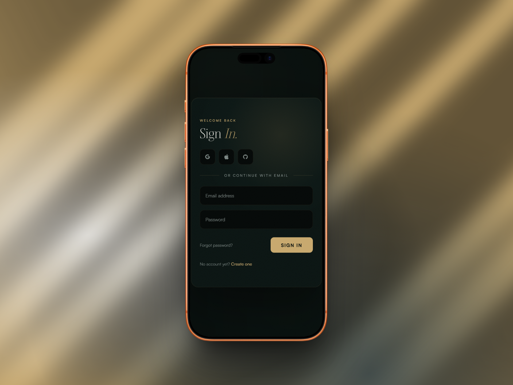

# Sign In Page


A premium dark sign-in page built with vanilla HTML, CSS, and JavaScript. Features a split-panel layout, floating labels on form inputs, social sign-in buttons, a mouse-tracked radial glow, and staggered entrance animations. No frameworks. No dependencies beyond CDN-hosted fonts and icons.

---

## Table of Contents

- [About](#about)
- [Features](#features)
- [Tech Stack](#tech-stack)
- [Live Demo](#live-demo)
- [Screenshots](#screenshots)
- [Getting Started](#getting-started)
- [Project Structure](#project-structure)
- [Accessibility](#accessibility)
- [License](#license)
- [Contact](#contact)
- [Support Me](#support-me)

---

## About

Sign In Page is a frontend UI component built as part of the NaxvenUI component library. It covers the full sign-in screen pattern used in premium SaaS and editorial products: a left panel with a social sign-in row, a floating-label email and password form, a forgot password link, and a sign-up prompt. A right decorative panel carries editorial copy and is hidden on small screens. The design uses a deep emerald dark palette with Antique Gold accents, Boska for headings, and Satoshi for body text.

---

## Features

- Split-panel layout: form on the left, editorial visual panel on the right
- Right panel hidden on viewports below 700px
- Card reveal animation on load (`translateY` + `scale` with cubic-bezier easing)
- Staggered `fadeUp` entrance for each form section (6 stages with incremental delay)
- Mouse-tracked radial glow on the form panel, active only on hover
- Floating label inputs: label animates to top-left on focus or when filled, using `scale(0.78)` transform
- Social sign-in buttons (Google, Apple, GitHub) with hover lift, border highlight, and gold glow
- Sign In button with shine sweep animation on hover (`::before` pseudo-element)
- Dual ambient orb background with `orbDrift` keyframe animations
- Grain texture overlay via inline SVG and `feTurbulence`
- Two responsive breakpoints: panel right hidden at 700px, form padding reduced at 400px
- Reduced motion support via `@media (prefers-reduced-motion: reduce)`

---

## Tech Stack

- HTML5
- CSS3 (custom properties, CSS design tokens, keyframe animations, floating label pattern with `~` combinator, `clamp`, `min`)
- Vanilla JavaScript (ES6+, IIFE pattern for mouse glow)
- Boska and Satoshi fonts via Fontshare CDN
- Remix Icons via jsDelivr CDN

---

## Live Demo

Live Demo available at: https://naxvenui-sign-in-1.netlify.app/

---

## Screenshots

**Smartphone Viewport**



**Laptop Viewport**


---

## Getting Started

No build step required. Clone or download the project and open `index.html` directly in your browser.

1. Clone the repository:

```bash
git clone https://github.com/NaxvenUI/sign-in-panel-1.git
cd newsletter_card_1
```

2. Open the file in your browser:

```bash
open index.html       # macOS
start index.html      # Windows
xdg-open index.html   # Linux
```

Or use a local development server:

```bash
npx serve .
```

Then open your browser and go to:

```
http://localhost:3000
```

---

## Project Structure

```
sign-in/
├── assets/
│   ├── css/
│   │   └── style.css
│   └── js/
│       └── script.js
├── docs/
│   └── screenshots/
│       ├── mockup_1.png
│       └── mockup_2.png
├── index.html
├── LICENSE
└── README.md
```

---

## Accessibility

- The form panel uses `<section>` with `aria-label="Sign in form"`.
- The right decorative panel uses `aria-hidden="true"`.
- Each `<input>` is associated with a `<label>` via matching `for` and `id` attributes.
- Email and password inputs include `autocomplete` attributes (`email`, `current-password`) and `required` with `aria-required="true"`.
- Social sign-in buttons carry individual `aria-label` attributes describing each provider.
- The social row group carries `aria-label="Sign in with a social account"`.
- The decorative divider is marked `aria-hidden="true"`.
- Background orbs are marked `aria-hidden="true"`.
- All transitions and animations respect `prefers-reduced-motion`.

---

## License

Distributed under the MIT License. See the [LICENSE](LICENSE) file for details.

---

## Contact

**NaxvenUI**

[](https://www.youtube.com/@NaxvenUI)

[](https://www.tiktok.com/@naxvenui)

[](https://www.instagram.com/naxvenui)

[](https://x.com/NaxvenUI)

## Support Me

[](https://buymeacoffee.com/naxvenui)

[](https://ko-fi.com/naxvenui)

[](https://www.patreon.com/naxvenui)
